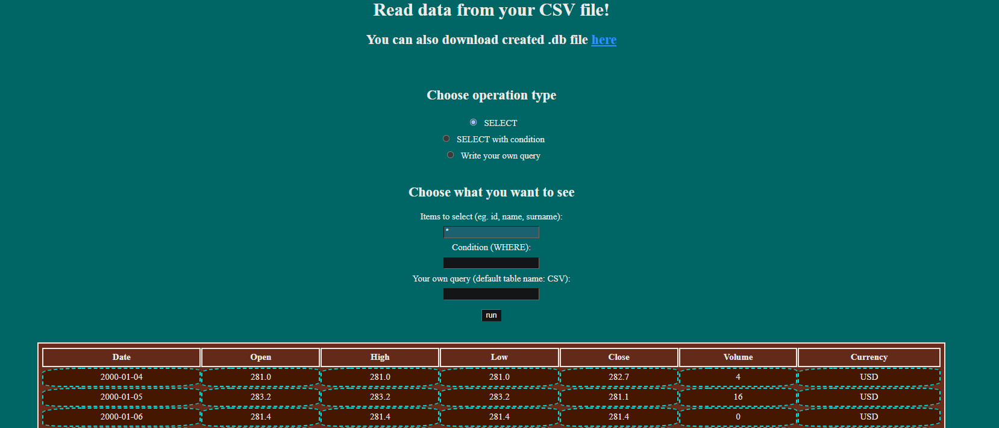

# CSV to DB python service

CSV to DB python service is a CSV file browser/editor. 

It converts .CSV files to .db, and then allows to perform operations on the data using SQL queries.

Communication between the server and the client is solved with simple and minimalistic HTML forms.

The project grants full sqlite functionality. Every CRUD action can be performed. 

Changes that are made are committed and the results can be downloaded as a .db file.

Results of executed SQL queries are also displayed on a HTML table after each execution.

## Architecture
Application provides 3 endpoints, with a corresponding HTML file for each one:

 * Endpoint 1

 -> "/" --> Starting/landing endpoint, calls "getcsv.html"
 
 -> "getcsv.html" --> Asks the client for the CSV file, and calls for "/datatypes"

 * Endpoint 2 

 -> "/datatypes" --> Reads CSV file, prepares the form asking the client for type of data in each column of the CSV file, calls datatypes.html
 
 -> "datatypes.html" --> Form asking the client for the types of data in each column, returns "/query"

 * Endpoint 3 

 -> "/query" --> Prints output from executing queries provided in POST on the table created from CSV, calls "query.html"
 
 -> "query.html" --> Form asking the client for query data, calls "/query"
 
## Gallery
